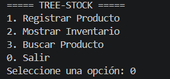
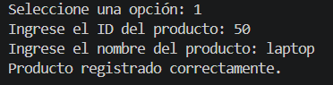
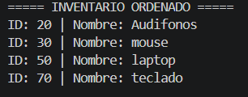
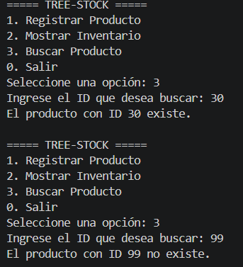

.] S30 - EA3. Actividad Final - Manipulación de Árboles en Java

Autor: Alejandro García

Tree-Stock - Sistema de Inventario

Aplicación de consola desarrollada en Java para gestionar un inventario utilizando un Árbol Binario de Búsqueda (ABB) implementado manualmente mediante nodos y punteros.

El sistema permite registrar productos, mostrar el inventario ordenado por ID y buscar productos mediante su identificador.

Objetivo

Comprender el concepto y funcionamiento de un Árbol Binario de Búsqueda y aplicar su estructura en un sistema de inventario desarrollado en Java.

El proyecto permite aplicar conceptos de:

- Árbol Binario de Búsqueda (ABB).
- Nodos.
- Punteros o referencias.
- Recursividad.
- Inserción de elementos.
- Recorrido Inorden.
- Búsqueda por ID.

Concepto de Árbol Binario de Búsqueda

Un Árbol Binario de Búsqueda (ABB) es una estructura de datos dinámica formada por nodos. Cada nodo puede tener como máximo dos hijos: uno izquierdo y uno derecho.

En este proyecto, cada nodo está representado por un objeto de la clase "Producto".

La organización del árbol sigue una regla:

- Los productos con un ID menor que el nodo actual se ubican hacia la izquierda.
- Los productos con un ID mayor que el nodo actual se ubican hacia la derecha.

Por ejemplo:

          50
         /  \
       30    70
      / \
    20  40

Esta organización permite realizar búsquedas y recorridos siguiendo la estructura del árbol.

Recursividad

La recursividad consiste en que un método se llama a sí mismo para resolver un problema dividiéndolo en partes más pequeñas.

En este proyecto se utiliza recursividad principalmente para:

- Insertar productos en la posición correspondiente.
- Buscar productos por ID.
- Recorrer el árbol en orden.

Por ejemplo, al insertar un producto, el programa compara su ID con el ID del nodo actual.

Si el nuevo ID es menor, la búsqueda continúa por el hijo izquierdo. Si es mayor, continúa por el hijo derecho. Este proceso se repite hasta encontrar una posición vacía donde se crea el nuevo nodo.

Recorrido Inorden

El recorrido Inorden visita los nodos siguiendo este orden:

Izquierda → Raíz → Derecha

En un Árbol Binario de Búsqueda, este recorrido permite mostrar los productos ordenados de menor a mayor según su ID.

Estructura del proyecto

Garcia_Alejandro_EA3_Arboles/
│
├── src/
│   ├── Producto.java
│   ├── ArbolInventario.java
│   └── Main.java
│
└── README.md

Clases utilizadas

Producto.java

Representa cada nodo del árbol.

Contiene:

- "int id"
- "String nombre"
- "Producto izquierdo"
- "Producto derecho"

Las referencias "izquierdo" y "derecho" permiten conectar cada producto con sus respectivos hijos dentro del árbol.

ArbolInventario.java

Contiene la lógica principal del Árbol Binario de Búsqueda.

Implementa:

- Inserción recursiva.
- Recorrido Inorden.
- Búsqueda recursiva por ID.

Main.java

Contiene la interfaz de consola y el menú interactivo del sistema.

Las opciones disponibles son:

1. Registrar Producto
2. Mostrar Inventario
3. Buscar Producto
0. Salir

Funcionamiento del sistema

1. Registrar Producto

Solicita el ID y el nombre del producto y lo inserta en la posición correspondiente del Árbol Binario de Búsqueda.

2. Mostrar Inventario

Realiza un recorrido Inorden para mostrar todos los productos organizados de menor a mayor según su ID.

3. Buscar Producto

Solicita un ID y realiza una búsqueda recursiva para determinar si el producto existe en el árbol.

0. Salir

Finaliza la ejecución del programa.

Requisitos

- Java JDK instalado.
- Visual Studio Code.
- Extensión de Java para Visual Studio Code.
- JDK de Eclipse Temurin.

Ejecución

1. Abrir la carpeta "Garcia_Alejandro_EA3_Arboles" en Visual Studio Code.
2. Abrir la carpeta "src".
3. Ejecutar el archivo "Main.java".
4. Seleccionar una opción del menú.
5. Seguir las instrucciones mostradas en la consola.

## Evidencias de ejecución

### Menú principal

Captura del menú principal de Tree-Stock.

### Registro de productos

Captura del registro de productos en el árbol.

### Inventario ordenado

Captura del recorrido Inorden mostrando los productos ordenados por ID.

### Búsqueda de producto

Captura de la búsqueda de un producto existente y no existente.

Video de sustentación

Video individual de sustentación explicando el funcionamiento del Árbol Binario de Búsqueda, la lógica de los punteros y la recursividad.

Enlace al video: PENDIENTE

Control de versiones

El proyecto utiliza Git y GitHub para el control de versiones.

El repositorio contiene los archivos del proyecto, el README y los cambios realizados mediante commits.

Autor

Alejandro García